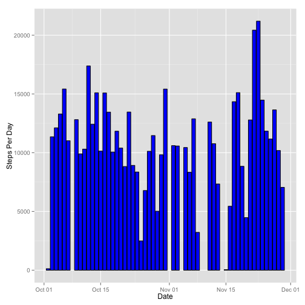
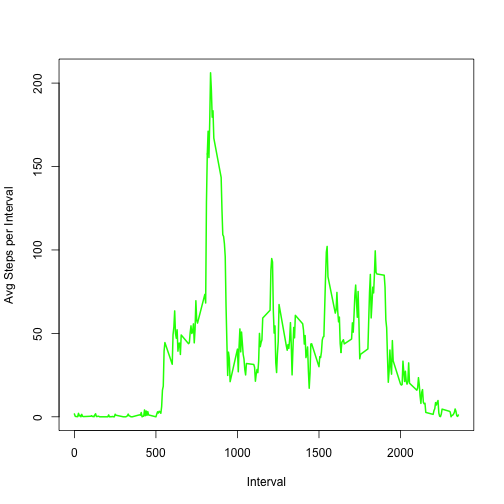
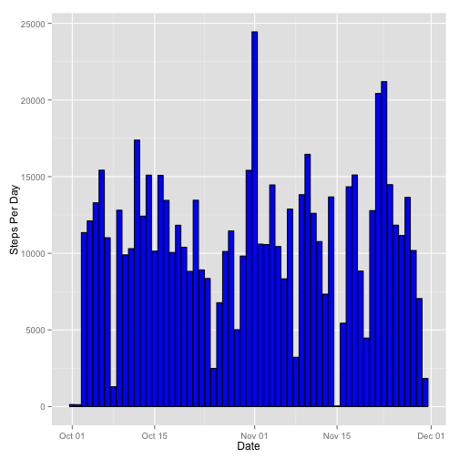
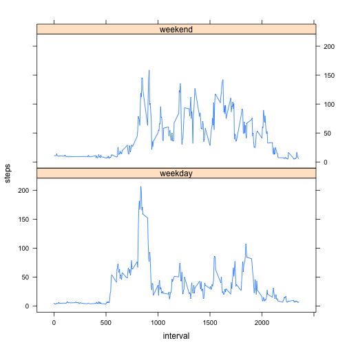

## Loading and preprocessing the data

Show any code that is needed to

1. Load the data (i.e. read.csv())
2. Process/transform the data (if necessary) into a format suitable for your analysis

The following function simply loads the CSV data, and removes NA rows:


```r
loaddata <- function() {
  activity <- read.csv('activity.csv')
  activity <- na.omit(activity)
  activity
}
```

## What is mean total number of steps taken per day?

For this part of the assignment, you can ignore the missing values in the dataset.

1. Make a histogram of the total number of steps taken each day
2. Calculate and report the mean and median total number of steps taken per day

For this section, the following code will facilitate:

1. Load the data, removing rows with NAs
2. Generate a histogram of the total steps per day
3. Calculate the mean and median values for the total steps per day.

Below is the histogram depicting the total steps per day, and the mean and median values for the total steps per day:


```r
library(ggplot2)
plotPerDay <- function(agg, ylab) {
  qplot(agg$x, binwidth=.5)
  p <- ggplot(agg, aes(x=names, y=x)) + 
    geom_histogram(stat="identity", binwidth=.5, colour="black", fill="blue") +
    xlab("Date") + ylab(ylab)
  p  
}
aggPerDay <- function(df, calc) {
  perDay <- aggregate(df$steps, by = list(df$date), calc)
  perDay$names <- as.Date(perDay$Group.1, format="%Y-%m-%d")
  perDay
}
histPerDay <- function(act) {
  stepsPerDay <- aggPerDay(act, "sum");
  p <- plotPerDay(stepsPerDay, "Steps Per Day");
  print(p)  
  stepsPerDay
}

question1 <- function() {
  act <- loaddata()
  stepsPerDay <- histPerDay(act)
  
  meanTotalPerDay = mean(stepsPerDay$x)
  medianTotalPerDay = median(stepsPerDay$x)
  
  print(paste('Mean total per day: ', meanTotalPerDay))
  print(paste('Median total per day: ', medianTotalPerDay))
}

question1();
```

 

```
## [1] "Mean total per day:  10766.1886792453"
## [1] "Median total per day:  10765"
```

## What is the average daily activity pattern?

1. Make a time series plot (i.e. type = "l") of the 5-minute interval (x-axis) and the average number of steps taken, averaged across all days (y-axis)
2. Which 5-minute interval, on average across all the days in the dataset, contains the maximum number of steps?


```r
aggPerInterval <- function(df, calc) {
  perInterval <- aggregate(df$steps, by = list(df$interval), calc)
  perInterval$names <- perInterval$Group.1
  perInterval
}
question2 <- function() {
  act <- loaddata()
  
  meanStepsPerInterval <- aggPerInterval(act, "mean")
  plot(meanStepsPerInterval$names, meanStepsPerInterval$x, type="l", xlab= "Interval", ylab= "Avg Steps per Interval", col="green" , lwd=2)
  
  idx <- which(meanStepsPerInterval$x == max(meanStepsPerInterval$x))  
  print(paste('Interval with maximum avg number of steps: ', meanStepsPerInterval[idx,1], ' steps: ', meanStepsPerInterval[idx,2]))
}
question2()
```

 

```
## [1] "Interval with maximum avg number of steps:  835  steps:  206.169811320755"
```

## Imputing missing values

Note that there are a number of days/intervals where there are missing values (coded as NA). The presence of missing days may introduce bias into some calculations or summaries of the data.

1. Calculate and report the total number of missing values in the dataset (i.e. the total number of rows with NAs)
2. Devise a strategy for filling in all of the missing values in the dataset. The strategy does not need to be sophisticated. For example, you could use the mean/median for that day, or the mean for that 5-minute interval, etc.
3. Create a new dataset that is equal to the original dataset but with the missing data filled in.
4. Make a histogram of the total number of steps taken each day and Calculate and report the mean and median total number of steps taken per day. Do these values differ from the estimates from the first part of the assignment? What is the impact of imputing missing data on the estimates of the total daily number of steps?

For this section, the following code will facilitate:

1. Calculate and print total # of missing values
2. Fill missing values with the mean value of the corresponding interval


```r
activityWithNoNas <- function() {
  act  <- read.csv('activity.csv')
  # fill missing with interval mean
  noNas <- loaddata();
  meanPerInterval  <- aggPerInterval(noNas, 'mean')
  merged <- merge(act[is.na(act),], meanPerInterval, by.x="interval", by.y="names")
  act[is.na(act),1] <- merged[,5]
  act
}

question3 <- function() {
  act  <- read.csv('activity.csv')
  totalMissing <- sum(is.na(act))
  print(paste('totalMissing: ', totalMissing))  
  
  act <- activityWithNoNas();
  
  stepsPerDay <- histPerDay(act)
  
  meanTotalPerDay = mean(stepsPerDay$x)
  medianTotalPerDay = median(stepsPerDay$x)
  
  print(paste('Mean total per day: ', meanTotalPerDay))
  print(paste('Median total per day: ', medianTotalPerDay))
  
}
question3()
```

```
## [1] "totalMissing:  2304"
```

 

```
## [1] "Mean total per day:  10766.1886792453"
## [1] "Median total per day:  11015"
```

These numbers differ by those presented in the first question, but not by a large amount.  The reasoning for this is because we are using the mean value for each interval, the differences between using NAs and means for the intervals is not significant.


## Are there differences in activity patterns between weekdays and weekends?

For this part the weekdays() function may be of some help here. Use the dataset with the filled-in missing values for this part.

1. Create a new factor variable in the dataset with two levels -- "weekday" and "weekend" indicating whether a given date is a weekday or weekend day.
2. Make a panel plot containing a time series plot (i.e. type = "l") of the 5-minute interval (x-axis) and the average number of steps taken, averaged across all weekday days or weekend days (y-axis). The plot should look something like the following, which was created using simulated data:


```r
library(lattice)
question4 <- function() {
  act <- activityWithNoNas();
  act$date <- as.Date(act$date)
  act$type <- ifelse((weekdays(act$date) %in% c('Saturday','Sunday')), 'weekend', 'weekday')

  weekdays <- aggPerInterval(act[act$type=='weekday',], 'mean')
  weekdays$type <- 'weekday'
  weekends <- aggPerInterval(act[act$type=='weekend',], 'mean')
  weekends$type <- 'weekend'
  all <- rbind(weekdays, weekends)
  names(all)[2] = "steps"
  names(all)[3] = "interval"
  xyplot( steps ~ interval | type, data=all, type="l", layout=c(1,2)) 
}
question4()
```

 
